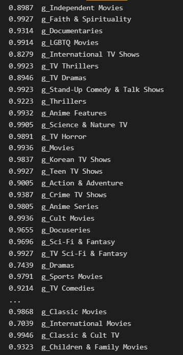

# NetflixContentInsights
KM6312 Group Work Project

Netflix Content Insights: A Comprehensive Analysis of Movies and TV Shows

DATASET FROM: https://www.kaggle.com/datasets/shivamb/netflix-shows

# 目录结构
| folders               |                   |
|-----------------------|-------------------|
| dataset               |                         |
| ├── original          | original dataset   |
| └── Task3preprocessed      | processed dataset for task3 |
| └── Task4preprocessed      | processed dataset for task4 |
| Category_Predict      | Task3 model       |
| ├── models          | models for task3   |
| Rating_Predict        | Task4 model       |
| ├── models          | models for task4  |
| Instructions          | guideline from teacher |
# Task3(delayed)
## Predict category according to description&title

compare the following models performance:

SVM;Decision Trees;Fastext;CNN

## Problem statement：

每个作品的类别往往有多个。举个例子，《真爱至上》会有三个类别：爱情，喜剧，都市。这使得分类任务不是简单的一维输出分类，而是多标签分类问题。

第一种解决思路：为简化任务回到简单的一维输出分类，在数据集处理部分仅保留每个作品的多个类别中的第一个类别，使得要预测的标签是唯一的。但造成新的问题：不再符合实际生活需要，准确率极低。

### 11.14 update：

所以目前采取第二种解决方案：对于每个样本，目标标签应该是一个二进制向量，表示每个类别是否存在。例如，如有三个类别：爱情，喜剧，都市，则样本标签 [1, 1, 1] ，表示作品属于这三个类别。而 [0, 1, 0] 表示只属于喜剧类别。如此，任务被确定为多标签文本分类任务Extreme Multi-label Text Classification（XMTC），即对于一个给定的文本，可能有多个标签，我们需要设计模型预测其标签。

*所以，模型输出层的激活函数采用sigmoid，而不是softmax。因为每个类别都是独立的，而不是互斥的。

*由于这是多标签分类任务，单一标签的准确率accuracy不足以评估整体性能。故而考虑采用其他指标，如F1-score，平均准确率等。

### 11.15 update：

多标签文本分类任务难度略大，尝试一些模型得到测试准确率均在20%左右，暂且搁置，先做下一个模型。（但我能检索到的在相同数据集上进行相同任务的项目，结果也是20%+准确率，怀疑是数据集问题）

### 11.16 update:

受其他XMTC项目启发，可以尝试OneVsRest方法。将多类分类问题转换为一系列二元分类问题。

###11.18 update:

尝试tfidf处理特征+OneVsRest分类，结果不错👍

相应地更新了task3的数据集预处理，重新划分了文件夹结构。

# Task4(ON GOING)
### 11.15 update:

单一标签分类问题，根据作品标题title和描述description预测它的分级rating。

原始数据集中分级rating有14种，并且每个类别的数量差异过大（见预处理记事本可视化情况，最多的类别有3000+数据，最少的类别只有20+数据）

所以为缓解类别不均衡，就根据14种分级的目标群众年龄，重新划分为'Teens', 'Adults', 'Older Kids', 'Kids'四个类别，保存在新列target_ages中。

任务即变化为，根据作品标题title和描述description分类它的target_age。

compare the following models performance:

SVM;Decision Trees;Fastext;CNN

*现面临问题：尝试了多个模型后（CNN LSTM SVM NB ResNet MLP..）训练集正常收敛，但网格搜参后每个模型最佳参数情况下得到验证集和测试集准确率均在50%+，验证集存在从头到尾准确率不变、学不到东西的问题。初步推测依然是数据集类别不平衡造成，所以目前数据集拆分更新为分层拆分方法，但没有帮助。然后采用K-Fold交叉验证方法，但没有本质上解决这个问题。需要周六和老师沟通如何解决，可能此数据集本身不太适合做预测或分类工作。

###  11.16 update:

*备选数据集：IMDB电影四类分级/在网飞数据集基础上多一列作品评分的数据集。最后的下下策是更换数据集或任务。先准备其他考试了orz

# Simple Github Guidance
### 通过git clone得到本地仓库
	git clone https://github.com/YANGKeyan/NetflixContentInsights.git

### 在本地仓库（文件夹）工作完成后，要上传文件：
	git pull origin main

	git add 要上传/更新的文件名称

	git commit -m "说明更改了什么"

	git push

