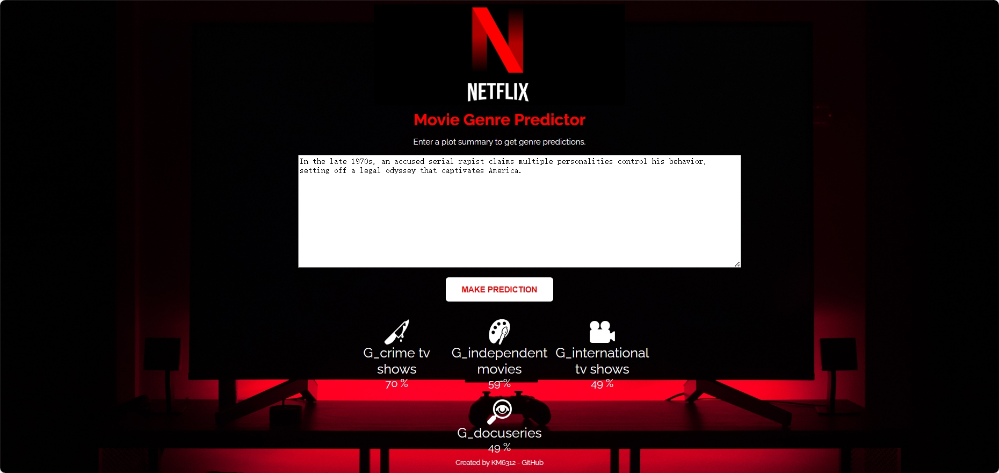

# NetflixContentInsights
KM6312 Project

Netflix Content Insights: A Comprehensive Analysis of Movies and TV Shows

DATASET FROM: https://www.kaggle.com/datasets/shivamb/netflix-shows

# Directory Structure
| folders               |                   |
|-----------------------|-------------------|
| dataset               |                     |
| ├── original          | original dataset   |
| └── Task3preprocessed | processed dataset for category predict |
| Category_Predict      | Task3 model       | 
| ├── models          | models saved for category predict |
| └── demo            | Model deployment with Flask  |
|	├── static      | css&images |
|	└── templates      | html |
| Rating_Predict(quit)    | quit task, plz ignore |
| Class_Instructions      | pics used in md |
| Pics          | guideline from teacher |
# Task1: Exploratory Data Analysis(Done)
# Task2: Clustering(Done)
# Task3: Category_Predict(Done)
## Predict category according to description&title

### 11.13 Problem update：

There are often multiple categories for each production. For example, True Blood will have three categories: romance, comedy, and urban. This makes the categorization task not a simple one-dimensional output classification, but a multi-label classification problem.

The first solution idea: to simplify the task back to simple one-dimensional output categorization, only the first of the multiple categories of each work is kept in the processing part of the dataset, making the label to be predicted unique. However, a new problem is created: it no longer meets real-life needs and leads to very low accuracy because the main category is often not the first one.

### 11.14 update：

So the second solution is currently adopted: for each sample, the target label should be a binary vector indicating whether each category exists or not. For example, if there are three categories: romance, comedy, and urban, the sample label [1, 1, 1] , indicates that the work belongs to these three categories. While [0, 1, 0] indicates that it belongs only to the comedy category. In this way, the task is identified as Extreme Multi-label Text Classification (XMTC), a classical task in text categorization tasks, i.e., for a given text, there may be more than one label, and we need to design models to predict the probability of its different labels.

*So, the activation function for the output layer of the model uses sigmoid instead of softmax. because each category is independent and not mutually exclusive.

*Since this is a multi-label classification task, single label accuracyaccuracy is not sufficient to evaluate the overall performance. Therefore, other metrics such as F1-score, average accuracy, etc. are considered.

### 11.15 update：

Multi-label text categorization task is slightly more difficult, try some models to get test accuracy are around 20%.

### 11.16 update:

Inspired by other XMTC projects, try the OneVsRest approach. That is, converting a multi-class classification problem into a series of binary classification problems.

### 11.18 update:

Tried tfidf processing features + OneVsRest classifier and it worked out fine!👍

The dataset preprocessing for this task was updated accordingly and the folder structure was reclassified.

### 11.23 update：

Simple model deployment was accomplished using Flask, allowing the model to be used as a tool in the form of a web page.

# Task4: Rating_Predict(Quit)
## Predict Rating according to description&title
